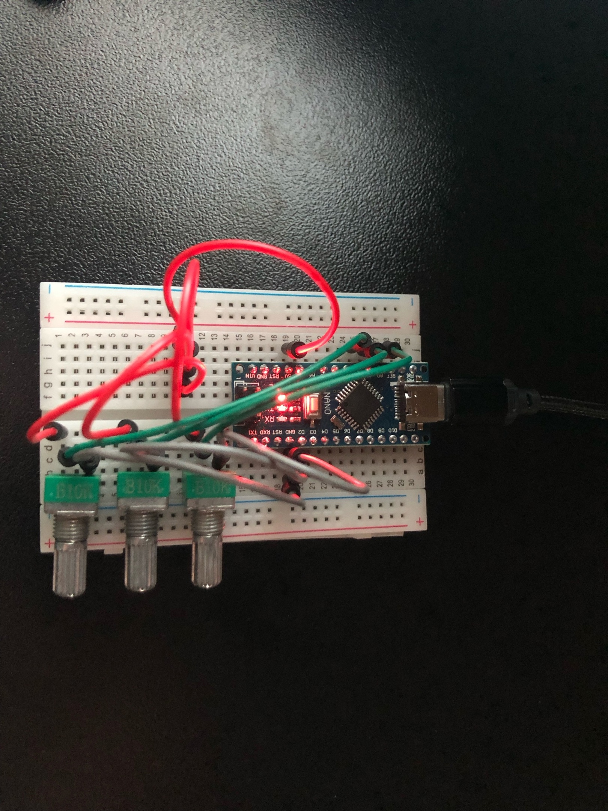

# AudioMix
AudioMix is ​​an audio mixer consisting of hardware and software (mvp). This project was inspired by [deej](https://github.com/omriharel/deej).

## Install
```
git clone https://github.com/zarnii/AudioMix.git
cd AudioMix
mkdir build
cd build
cmake ..
```

## Hardware
- Arduino Nano
- Potentiometer x3
- Development board
- Connecting wire x 10
- USB to Type-C cable

